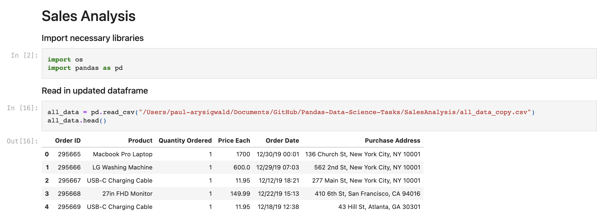
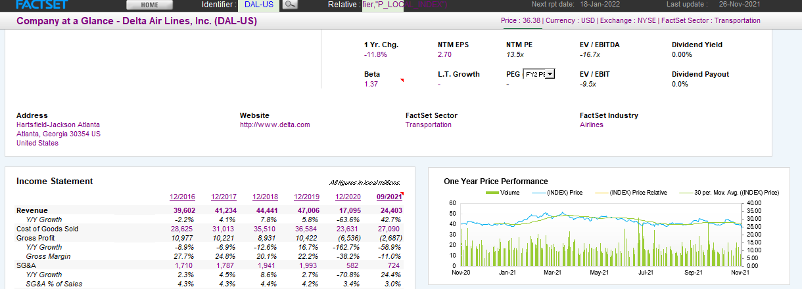
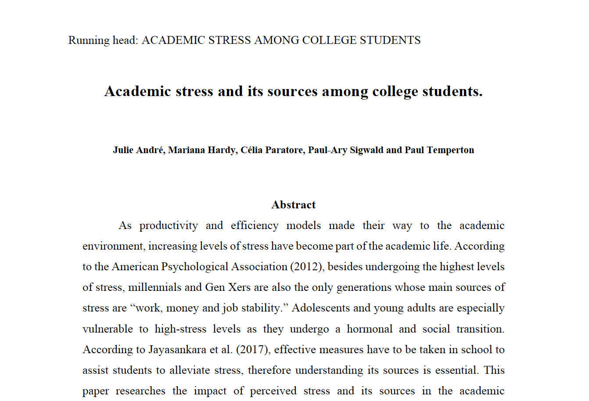

# Welcome to Paul-Ary's portfolio website


## Who am I? 

Hi, my name is Paul-Ary. I'm a final year finance major pursuing a joint program between Concordia University & Skema Business School (France). I am proud to share that I have been awarded a €2000 schorlarship by Skema and that I have been admitted to the Beta Gamma Sigma Honors Society recognizing the top 10% of undergrad students at Concordia. Those awards are an acknowledgment of all the hard work I have put into my studies.

My experiences have provided me with some accounting knowledge of a medium-sized firms and have enhanced my interest in pursuing a career in finance. Therefore, planning on passing the CFA level-1 after my graduation in May 2022. I also have high interest for data analytics. I have passed courses in Python & SQL. Additionally, I have enrolled into online degree with MIT in Statistics and Data Science as I would like to pursue a career in Actuarial Sciences. 

To learn more about me please visit my [LinkedIn Profile](https://www.linkedin.com/in/paulary-sigwald/) or preview my [CV](https://github.com/PAS720/Paul-Ary_Portfolio/blob/main/Resume%20-%20Paul-ary-Sigwald.pdf)

### Skills
```
LANGUAGES: French, English, Dutch
FINANCE SKILLS: Capital IQ, Bloomberg, FactSet, DCF
IT SKILLS: Python, SQL, Word, SAP, Excel (Pivot Tables, VLOOKUP, Macro's & VBA), Outlook, PowerPoint, Github
```


## My Projects


### [Sales Analysis in Python](https://github.com/PAS720/Paul-Ary_Portfolio/blob/main/SalesAnalysis.ipynb)
This research showcases the descriptive power of data when manipulated with Python. Businesses should embrace data as it improves cutomer experience, helps mitigate risk and provide firm with more reliable forecasts. This analysis could have been improved if combined with other visualization tools such as seaborn library in Python, Tableau or PowerBI. Stay tuned for a new project with visual improvements! The data has been retrieved from Github. 

[](https://github.com/PAS720/Paul-Ary_Portfolio/blob/main/SalesAnalysis.ipynb)


### [Delta Airlines Valuation using Factset](https://github.com/PAS720/Paul-Ary_Portfolio/blob/main/Projects/Delta%20Air%20Lines%20Analysis.xlsx)
**DISCLAIMER:** THIS FILE IS A NON-REFRESHING COPY: The Factset add-on requires to login to access the excel file. Therefore I have made a copy so that everybody could access it.

This valuation of Delta Airlines was built as part of my Investesment Analysis final project at Concordia. It includes:
- Industry Analysis
- Debt Capital valuation
- Revenue Forecasts
- Revenue segmentation per industry
- CAPEX adjustments for R&D and Leases
- Bottom-up Beta's
- Geographic segmentation and equition risk premiums
- Intrinsic valuation
- FCFE & FCFF
- Relative valuation using exit multiple

[](https://github.com/PAS720/Paul-Ary_Portfolio/blob/main/Projects/Delta%20Air%20Lines%20Analysis.xlsx)


### [Academic Stress Amongst College Students Study](https://github.com/PAS720/Paul-Ary_Portfolio/blob/main/Group%202%20-%20Stress%20among%20college%20students.pdf)
This research essay for handed-in for spychological study at Skema Business School. This paper researches the impact of perceived stress and its sources in the academic environment. The main goal was to ascertain that academic stress exists and to determine its source. Based on literature reviews and Rajendran & Kaliappan academic stress scale of 1991 (Psychological Resources, 2014), we conducted a quantitative survey design administered across a variety of academic segments (management & economics, engineering, law & politics, medical studies, and humanities).


[](https://github.com/PAS720/Paul-Ary_Portfolio/blob/main/Group%202%20-%20Stress%20among%20college%20students.pdf)
